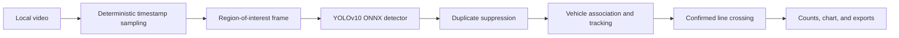

# AIVision Traffic Counter — Presenter Brief

Use this page as the talk track for a short product and technical demonstration.

## One-sentence pitch

AIVision Traffic Counter analyzes a road video locally in the browser, detects and tracks vehicles, and records a count only when a confirmed vehicle crosses a configurable counting line.

## What problem it solves

A raw object detector reports boxes independently on every frame. Adding those boxes does not produce a traffic count: the same car may appear hundreds of times, detections may disappear briefly, and false positives may flicker into existence.

This application adds the state required for useful counting:

- associates detections with persistent vehicle tracks;
- confirms a track across multiple observations;
- survives short detection gaps using motion prediction;
- counts only a real line crossing;
- counts each track once per zone;
- separates upward, downward, leftward, and rightward screen motion; and
- reports totals by class, direction, zone, and time bucket.

## Five-minute demo

1. From the repository folder on Windows, run:

   ```powershell
   powershell -ExecutionPolicy Bypass -File .\setup-and-run.ps1
   ```

2. The script installs a supported Node.js LTS release when necessary, installs exact npm dependencies, prepares local ONNX Runtime assets, starts Vite, and opens the app.
3. Drop an MP4, MOV, or WebM traffic video onto the video stage.
4. Select **Edit zones**, choose **Horizontal** or **Vertical** for the active counting line, and show that the region and line can be moved.
5. Explain the three main performance and quality controls:
   - **Processing device** chooses Auto, GPU/WebGPU, or CPU/WebAssembly.
   - **Confidence** balances recall against false detections.
   - **Sampling rate** balances temporal detail against total analysis time.
6. Select **Start analysis**.
7. Point out confirmed tracks, trails, vehicle classes, line crossings, and direction totals.
8. Show the session totals, per-zone breakdown, and five-second traffic-flow chart.
9. Export either event CSV, summary CSV, or JSON.
10. Restart the same analysis to demonstrate deterministic video-time sampling.

## Processing flow



The video remains on the user's machine. Model inference and result generation happen in the browser.

## Technology used

| Area | Technology | Purpose |
|---|---|---|
| UI | React 19 + TypeScript | Dashboard, controls, zones, and results |
| Build | Vite 8 | Development server and production build |
| Detection | YOLOv10-N / YOLOv10-M | Vehicle bounding boxes and COCO class labels |
| Model runtime | Transformers.js + ONNX Runtime Web | Local browser inference |
| Acceleration | User-selectable Auto, GPU/WebGPU, or CPU/WASM | Hardware acceleration and compatible fallback |
| Tracking | Custom SORT-like tracker | Detection association, confirmation, and gap recovery |
| Rendering | HTML video + Canvas 2D | Synchronized boxes, trails, zones, and lines |
| Testing | Vitest + ESLint + TypeScript | Behavioral contracts and static verification |

Supported displayed classes are car, truck, bus, and motorcycle.

## Why the counts are more reliable

The original implementation could count a persistent detection without a crossing, count again when a track disappeared, and produce different results when a slow machine skipped frames.

The rebuilt engine instead:

- seeks through fixed video timestamps rather than following playback speed;
- requires repeated observations before confirming a vehicle;
- associates vehicles using predicted position, overlap, distance, size, and class history;
- buffers an early crossing until a tentative track becomes confirmed;
- uses cumulative class confidence to reduce label flicker; and
- emits an event only when two real observations lie on opposite sides of the line.

Stationary objects and tracks that merely disappear are not counts.

## What an exported event contains

Each event records:

- event sequence;
- track ID;
- zone ID;
- vehicle class;
- crossing direction; and
- timestamp in the source video.

The JSON export also includes engine details, analysis configuration, zone geometry, and aggregate results.

## Verification evidence

The current web application passes:

- the TypeScript production build;
- ESLint; and
- 26 behavioral unit tests across tracking, horizontal and vertical crossing, geometry, exports, and aggregation.

A repeated real-video test on a 21.5-second 4K highway clip produced the same result twice: 10 crossing events, split into 7 downward and 3 upward events, with 8 cars and 2 trucks.

## Honest limitations

- Detection quality is limited by the model and its training data.
- The bundled model is trained on COCO and works best with ordinary oblique roadside or highway views.
- Strict overhead vehicles can look unlike COCO vehicles and may be missed or assigned the wrong class.
- Very small, blurred, heavily occluded, or poorly lit vehicles remain difficult.
- Browser processing speed depends on resolution, hardware, and WebGPU availability.
- The Flutter directories are a future native scaffold; the maintained runnable product is the web application under `web/`.

These limitations should not be hidden by lowering confidence until arbitrary objects are counted.

## Deferred detector upgrade

The next major model phase is intentionally postponed. When it begins, the preferred plan is to evaluate:

1. RF-DETR Nano or Small fine-tuned on UAVDT, VisDrone, and frames from the deployment camera;
2. an aerial YOLO oriented-bounding-box model as a fast top-down baseline; and
3. a lightweight custom YOLO model if Ultralytics licensing is acceptable.

The decision should be based on missed crossings, false crossings, duplicate events, class confusion, browser inference time, memory, and model download size—not generic COCO benchmark accuracy alone.

## Useful answers during Q&A

**Does it upload videos?**  
No. The selected file, inference, tracking, and exports remain local to the browser.

**Why not count every detection?**  
A detector sees the same vehicle in many frames. Tracking establishes identity; crossing logic turns that identity into one event.

**Why use a counting line?**  
It creates an explicit, auditable traffic event and avoids counting parked or persistent objects.

**Will results vary on a faster computer?**  
The sampling timestamps are derived from video time, so machine speed changes analysis duration rather than which timestamps are processed.

**Can it count two carriageways?**  
Yes. Use separate zones or one shared zone. Horizontal lines split upward/downward motion; vertical lines split leftward/rightward motion.

**Can it become a live-camera system?**  
The tracking and crossing engine can be reused, but live ingestion needs a different frame scheduler and operational monitoring. The current delivered workflow analyzes uploaded video files.
