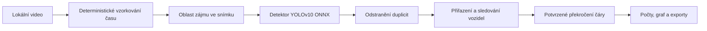

# AIVision Traffic Counter — podklady pro prezentujícího

Tento dokument slouží jako stručný scénář pro produktovou a technickou ukázku aplikace.

## Představení jednou větou

AIVision Traffic Counter analyzuje dopravní video lokálně v prohlížeči, detekuje a sleduje vozidla a započítá je pouze tehdy, když potvrzená stopa vozidla překročí nastavitelnou sčítací čáru.

## Jaký problém aplikace řeší

Samotný detektor objektů vykresluje v každém snímku nové obdélníky. Jejich prosté sečtení ale nedává skutečný počet vozidel: stejné auto může být vidět ve stovkách snímků, detekce může na okamžik zmizet a chybné detekce se mohou krátce objevovat a zase mizet.

Aplikace proto doplňuje stav a pravidla nutná pro skutečné sčítání dopravy:

- spojuje detekce do trvalých stop vozidel;
- potvrzuje stopu až po několika pozorováních;
- pomocí predikce pohybu překonává krátké výpadky detekce;
- počítá pouze skutečné překročení čáry;
- každou stopu započítá v dané zóně pouze jednou;
- rozlišuje pohyb směrem nahoru a dolů v obrazu; a
- zobrazuje výsledky podle třídy, směru, zóny a časového úseku.

## Pětiminutová ukázka

1. Ve Windows spusťte v kořenové složce repozitáře:

   ```powershell
   powershell -ExecutionPolicy Bypass -File .\setup-and-run.ps1
   ```

2. Skript podle potřeby nainstaluje podporovanou LTS verzi Node.js, nainstaluje přesné npm závislosti, připraví lokální soubory ONNX Runtime, spustí Vite a otevře aplikaci.
3. Přetáhněte dopravní video ve formátu MP4, MOV nebo WebM do prostoru videa.
4. Zvolte **Edit zones** a ukažte, že lze měnit polohu i velikost detekční oblasti a posouvat sčítací čáru.
5. Vysvětlete tři hlavní ovladače výkonu a kvality:
   - **Processing device** volí automatický režim, GPU/WebGPU nebo CPU/WebAssembly.
   - **Confidence** vyvažuje počet zachycených vozidel proti chybným detekcím.
   - **Sampling rate** vyvažuje časové rozlišení proti celkové délce analýzy.
6. Zvolte **Start analysis**.
7. Ukažte potvrzené stopy, trajektorie, třídy vozidel, překročení čáry a počty podle směru.
8. Ukažte celkové výsledky relace, výsledky jednotlivých zón a graf průtoku dopravy po pěti sekundách.
9. Vyexportujte události do CSV, souhrn do CSV nebo kompletní JSON.
10. Spusťte stejnou analýzu znovu a demonstrujte deterministické vzorkování podle času videa.

## Tok zpracování



Video zůstává v zařízení uživatele. Inference modelu, sledování i tvorba výsledků probíhají v prohlížeči.

## Použité technologie

| Oblast | Technologie | Účel |
|---|---|---|
| Uživatelské rozhraní | React 19 + TypeScript | Dashboard, ovládání, zóny a výsledky |
| Sestavení aplikace | Vite 8 | Vývojový server a produkční build |
| Detekce | YOLOv10-N / YOLOv10-M | Ohraničení vozidel a názvy tříd COCO |
| Běh modelu | Transformers.js + ONNX Runtime Web | Lokální inference v prohlížeči |
| Akcelerace | Volitelný režim Auto, GPU/WebGPU nebo CPU/WASM | Hardwarová akcelerace a kompatibilní náhradní režim |
| Sledování | Vlastní tracker typu SORT | Přiřazení detekcí, potvrzení a překlenutí výpadků |
| Vykreslování | HTML video + Canvas 2D | Synchronizované boxy, trajektorie, zóny a čáry |
| Testování | Vitest + ESLint + TypeScript | Testy chování a statická kontrola |

Zobrazované třídy jsou osobní automobil, nákladní automobil, autobus a motocykl.

## Proč je sčítání spolehlivější

Původní implementace mohla započítat trvalou detekci bez překročení čáry, započítat vozidlo znovu po zániku stopy a na pomalejším počítači přeskakovat snímky, takže výsledky závisely na výkonu zařízení.

Nový engine naproti tomu:

- prochází pevné časové body videa místo závislosti na rychlosti přehrávání;
- před potvrzením vozidla vyžaduje opakovaná pozorování;
- přiřazuje vozidla podle predikované polohy, překryvu, vzdálenosti, velikosti a historie třídy;
- uchová dřívější překročení, dokud se předběžná stopa nepotvrdí;
- používá kumulativní jistotu třídy, čímž omezuje přeskakování názvů; a
- vytvoří událost pouze tehdy, když dvě skutečná pozorování leží na opačných stranách čáry.

Stojící objekty ani stopy, které pouze zmizí, se nezapočítávají.

## Co obsahuje exportovaná událost

Každá událost obsahuje:

- pořadové číslo události;
- ID stopy;
- ID zóny;
- třídu vozidla;
- směr překročení; a
- čas ve zdrojovém videu.

JSON navíc obsahuje údaje o použitém enginu, nastavení analýzy, geometrii zón a souhrnné výsledky.

## Důkazy ověření

Aktuální webová aplikace úspěšně prochází:

- produkčním sestavením TypeScriptu;
- kontrolou ESLint; a
- 21 behaviorálními testy sledování, překročení čáry, geometrie a agregace.

Opakovaný test na reálném 21,5sekundovém 4K videu z dálnice dal při obou spuštěních stejný výsledek: 10 událostí, z toho 7 směrem dolů a 3 směrem nahoru, s klasifikací 8 osobních a 2 nákladních vozidel.

## Otevřeně uvedená omezení

- Kvalita detekce je omezena modelem a jeho trénovacími daty.
- Dodaný model je trénovaný na COCO a nejlépe funguje na běžných šikmých záběrech ze silnice nebo nadjezdu.
- Vozidla snímaná striktně kolmo shora mohou vypadat jinak než vozidla v COCO, takže je model může přehlédnout nebo jim přiřadit nesprávnou třídu.
- Velmi malá, rozmazaná, silně zakrytá nebo špatně osvětlená vozidla zůstávají náročná.
- Rychlost zpracování v prohlížeči závisí na rozlišení videa, hardwaru a dostupnosti WebGPU.
- Složky Flutteru jsou základem pro budoucí nativní aplikaci; aktuálním udržovaným produktem je webová aplikace ve složce `web/`.

Tato omezení se nemají skrývat snížením prahu jistoty tak hluboko, že se začnou počítat náhodné objekty.

## Odložené vylepšení detektoru

Další velká fáze vývoje modelu je záměrně odložena. Až začne, plánem je vyhodnotit:

1. RF-DETR Nano nebo Small dotrénovaný na UAVDT, VisDrone a snímcích z cílové kamery;
2. letecký model YOLO s orientovanými boxy jako rychlou výchozí variantu pro pohled shora; a
3. lehký vlastní model YOLO, pokud budou přijatelné licenční podmínky Ultralytics.

Rozhodnutí se má opírat o počet přehlédnutých a chybných překročení, duplicity, záměny tříd, dobu inference v prohlížeči, spotřebu paměti a velikost modelu — nikoli pouze o obecné COCO benchmarky.

## Užitečné odpovědi při dotazech

**Nahrává aplikace video na server?**  
Ne. Vybraný soubor, inference, sledování i exporty zůstávají lokálně v prohlížeči.

**Proč nestačí sečíst všechny detekce?**  
Detektor vidí stejné vozidlo v mnoha snímcích. Sledování určí jeho identitu a pravidlo překročení z této identity vytvoří právě jednu událost.

**Proč se používá sčítací čára?**  
Vytváří jednoznačnou a kontrolovatelnou dopravní událost a zabraňuje započítání zaparkovaných nebo trvale viditelných objektů.

**Budou výsledky na rychlejším počítači jiné?**  
Časové body se odvozují z času videa. Výkon zařízení proto mění délku analýzy, ne výběr zpracovaných časových bodů.

**Lze sčítat dva směry nebo dva jízdní pásy?**  
Ano. Lze použít samostatné zóny nebo jednu společnou zónu a výsledky rozdělit podle pohybu nahoru a dolů.

**Lze aplikaci změnit na systém pro živou kameru?**  
Engine sledování a překročení lze znovu použít, ale živý vstup vyžaduje jiný plánovač snímků a provozní monitoring. Aktuální dodaná verze analyzuje nahrané videosoubory.
